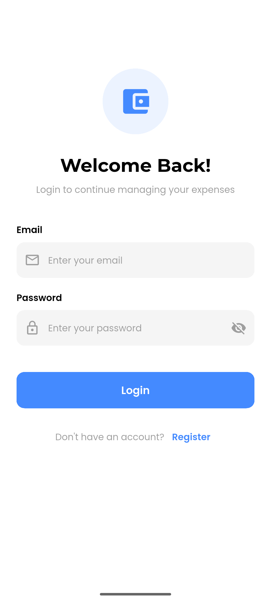
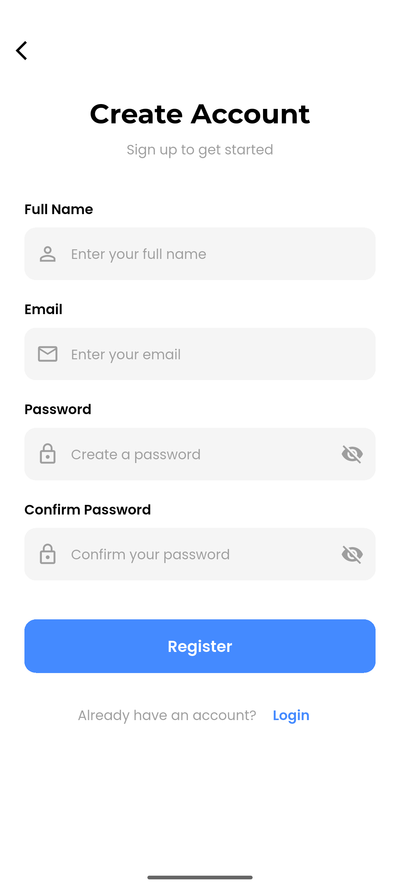
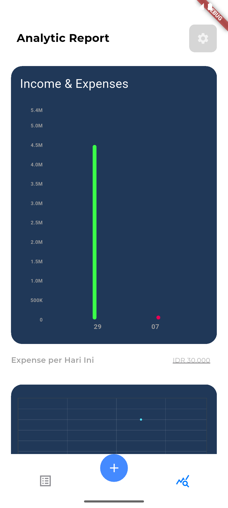
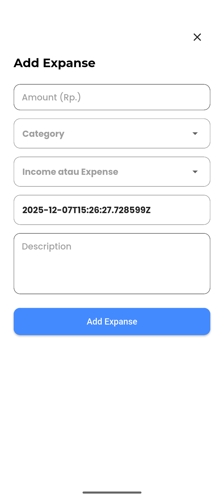
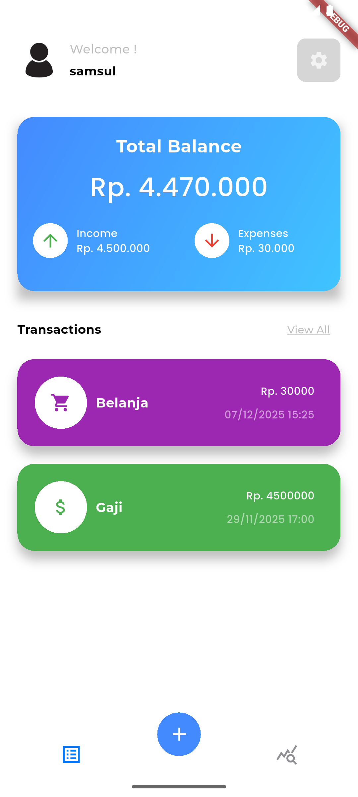
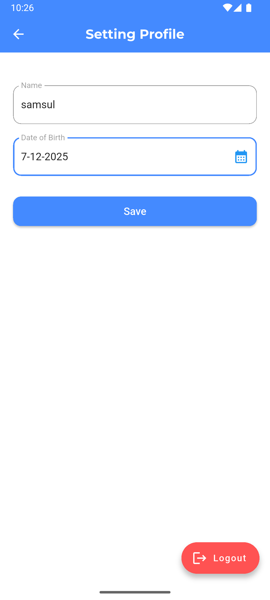
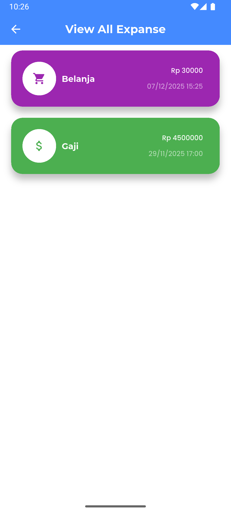

# 🏠 Expanse apps 

| Flutter | Golang |
|---------|--------|
| [](https://flutter.dev) | [](https://go.dev) |


Aplikasi ini dibuat untuk mempermudah proses pencatatan pengeluaran dan pemasukan agar lebih cepat, rapi, dan efisien. Dengan tampilan yang sederhana, pengguna dapat memonitor alur keuangan harian tanpa ribet. Setiap transaksi yang dicatat akan tersimpan otomatis sehingga meminimalkan kesalahan dan membantu pengguna memahami ke mana uang mereka digunakan. Aplikasi Expanse diharapkan dapat membantu pengelolaan keuangan menjadi lebih teratur, transparan, dan modern.

## 📸 Screenshotsl

| Login | Register |
|-------|-------|
|  |  |

| Analytic | Add Expanses |
|--------|--------------|
|  |  |

| Home | Setting |
|---------|------|
|  |  |

| view all | 
|---------|
|  |


## 🛠 Cara Menjalankan Project

### **1. Clone Repository**
```
git clone <repo-url>
```


### **2. Setup Flutter**
```
cd <repo>
flutter pub get
flutter run
```

### **3. Setup Golang**
```
cd <repo>
go mod tidy
go run main.go
```
**Noted:**  
Pastikan Anda sudah menginstal **Golang** pada perangkat Anda agar backend dapat dijalankan dengan benar.

---


## 📱 Fitur Aplikasi

- Tambah data **income** maupun **expenses** dengan mudah.
- Data transaksi yang ditambahkan akan langsung muncul di halaman **Home** beserta total angkanya.
- Menyediakan **grafik keuangan** untuk melihat transparansi alur pemasukan & pengeluaran.
- Terdapat halaman **detail transaksi** untuk melihat informasi lengkap.
- Mendukung fitur **CRUD** (Create, Read, Update, Delete) untuk setiap transaksi.
- Menampilkan **grafik bulanan** dan **grafik harian** untuk memantau pola keuangan pengguna.

 
